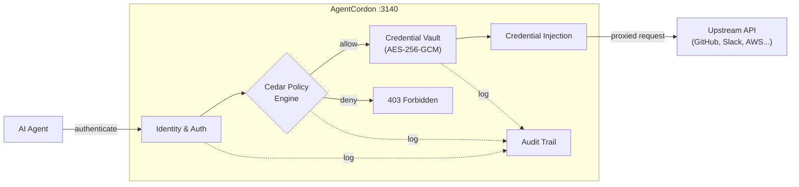

<picture>
  <source media="(prefers-color-scheme: dark)" srcset="docs/assets/banner-dark.svg">
  <source media="(prefers-color-scheme: light)" srcset="docs/assets/banner-light.svg">
  
</picture>

<p align="center">
  <b>Secure credential brokerage for AI agents.</b><br/>
  Store credentials once. Enforce policies everywhere. Agents never see the keys.
</p>

<p align="center">
  <a href="https://agentcordon.dev">Website</a> &middot;
  <a href="https://agentcordon.dev/docs">Docs</a> &middot;
  <a href="https://discord.gg/agentcordon">Discord</a>
</p>

---



## What is AgentCordon?

AgentCordon is a self-hostable identity provider and credential broker that lets AI agents use API credentials without ever seeing them. It sits between your agents and the services they call, acting as a secure proxy that injects credentials only after verifying authorization.

The problem is straightforward: AI agents need API keys to be useful. Today, most teams solve this by pasting secrets into agent prompts or environment variables. Every agent ends up holding long-lived credentials with no access controls, no audit trail, and no way to revoke access without rotating the key everywhere. As you scale from one agent to dozens, this becomes a security nightmare.

AgentCordon fixes this. You store credentials in an encrypted vault (AES-256-GCM). Agents authenticate via workspace identity (Ed25519 keypair) or OAuth. When an agent needs to call an API, AgentCordon evaluates Cedar authorization policies, and if allowed, injects the credential into the upstream request. The agent never touches the real secret. Every decision is logged with full context -- who, what, when, and why.

## Architecture

The system is organized into three Rust crates:

- **[Core](crates/core)** -- Domain types, Cedar policy evaluation, Ed25519/HKDF/AES-256-GCM crypto
- **[Server](crates/server)** -- Axum HTTP server, web dashboard, credential proxy, audit pipeline
- **[Gateway](crates/gateway)** -- MCP gateway, JSON-RPC proxy with credential injection

## Quick Start

```bash
docker run -p 3140:3140 ghcr.io/agentcordon/agentcordon:latest
```

Open [http://localhost:3140](http://localhost:3140). A random admin password is printed to the console on first boot.

For production:

```bash
docker run -d \
  --name agentcordon \
  -p 3140:3140 \
  -e AGTCRDN_MASTER_SECRET="your-strong-secret-here" \
  -v agentcordon-data:/data \
  ghcr.io/agentcordon/agentcordon:latest
```

Or with Docker Compose:

```bash
curl -O https://raw.githubusercontent.com/agentcordon/agentcordon/main/docker-compose.yml
docker compose up -d
```

## Features

- **Encrypted credential vault** (AES-256-GCM) -- secrets decrypted only at proxy time
- **Cedar policy engine** -- deny-by-default, deterministic, testable authorization
- **Credential proxy** -- agents call APIs through AgentCordon, never see raw tokens
- **Workspace identity** -- Ed25519 keypair per project, passwordless enrollment
- **MCP gateway** -- proxy MCP tool calls with credential injection and Cedar policy enforcement
- **OAuth 2.1 server** -- PKCE S256 and client credentials grants
- **OIDC / SSO** -- Google, Azure AD, Okta, any OpenID Connect provider
- **Full audit trail** -- structured logs with correlation IDs, SOC/IR ready
- **Self-hosting first** -- Docker, Compose, Kubernetes, air-gap capable

## Project Structure

```
agentcordon/
  crates/
    core/       Domain types, Cedar policy evaluation, crypto primitives
    server/     Axum HTTP server, routes, middleware, UI
    gateway/    MCP gateway and JSON-RPC proxy
  migrations/   SQL migrations (SQLite)
  policies/     Default Cedar policy files
  docs/         OpenAPI spec and documentation
```

## Building from Source

Requires Rust 1.75 or later.

```bash
git clone https://github.com/agentcordon/agentcordon.git
cd agentcordon
cargo build --release
```

Binaries are written to `target/release/`:

- `agent-cordon-server` -- Control plane server (port 3140)
- `agentcordon` -- CLI for agent enrollment and credential proxy

## Configuration

AgentCordon uses environment variables prefixed with `AGTCRDN_`:

| Variable | Default | Description |
|----------|---------|-------------|
| `AGTCRDN_PORT` | `3140` | Server listen port |
| `AGTCRDN_DB_PATH` | `/data/agent-cordon.db` | SQLite database path |
| `AGTCRDN_MASTER_SECRET` | auto-generated | Master encryption key (persist this in production) |
| `AGTCRDN_ROOT_USERNAME` | auto-generated | Admin username |
| `AGTCRDN_ROOT_PASSWORD` | auto-generated | Admin password (printed on first boot) |
| `AGTCRDN_SEED_DEMO` | `true` | Seed demo data on first boot |

See [`.env.example`](.env.example) for the full configuration reference.

## Security

AgentCordon is designed with a zero-trust posture:

- **Deny by default.** All access requires an explicit Cedar policy grant.
- **Credentials encrypted at rest** with AES-256-GCM. Decryption keys are derived per-credential using HKDF.
- **No credential exposure.** Agents interact through a proxy; raw tokens are injected server-side.
- **Workspace identity** uses Ed25519 keypairs with no shared secrets.
- **Audit everything.** Every credential access, policy evaluation, and token operation is logged with correlation IDs.

To report a security vulnerability, please email security@agentcordon.dev.

## Contributing

Contributions are welcome. Please open an issue to discuss significant changes before submitting a pull request.

```bash
cargo test --workspace
cargo clippy --workspace -- -D warnings
cargo fmt --all
```

## License

AgentCordon is licensed under the [MIT License](LICENSE).

---

<p align="center">
  <a href="https://agentcordon.dev">Website</a> &middot;
  <a href="https://github.com/agentcordon/agentcordon/issues">Issues</a> &middot;
  <a href="https://github.com/agentcordon/agentcordon/releases">Releases</a>
</p>
