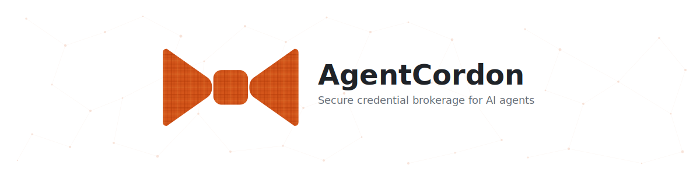
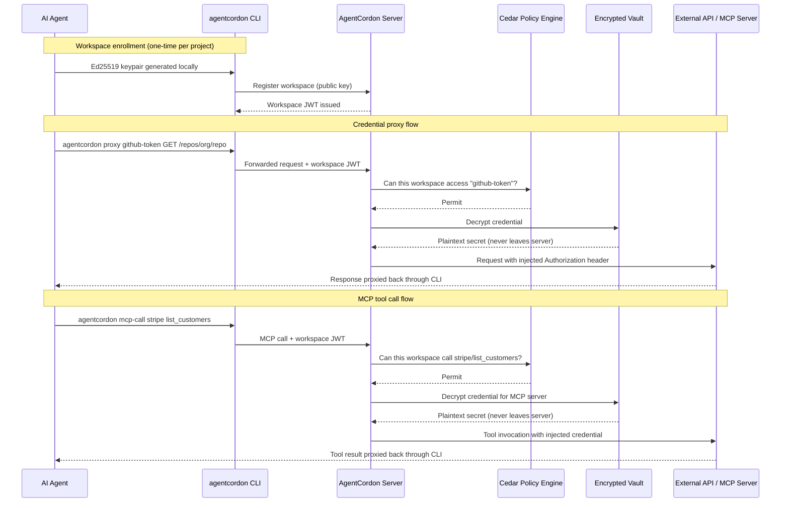

<picture>
  <source media="(prefers-color-scheme: dark)" srcset="docs/assets/banner-dark.svg">
  <source media="(prefers-color-scheme: light)" srcset="docs/assets/banner-light.svg">
  
</picture>

<h3 align="center">Your agents call APIs. They never see the keys.</h3>

<p align="center">
  AgentCordon is a self-hostable credential broker for AI agents.<br/>
  Store secrets in an encrypted vault, enforce access policies, and proxy every API call — with a full audit trail.
</p>

<p align="center">
  <a href="https://agentcordon.dev">Website</a> &middot;
  <a href="https://agentcordon.dev/docs">Docs</a> &middot;
  <a href="https://discord.gg/agentcordon">Discord</a>
</p>

---

## The Problem

AI agents need API keys. Most teams paste them into prompts or environment variables. Every agent holds long-lived credentials with no access controls, no audit trail, and no revocation path. That doesn't scale.

## How AgentCordon Fixes It

Agents authenticate to AgentCordon with a workspace identity (Ed25519 keypair). When they need to call an API, AgentCordon evaluates Cedar authorization policies and, if allowed, injects the credential into the upstream request server-side. The agent never touches the secret.



## See It In Action

An AI agent checks a Cloudflare deployment and queries AWS IAM policies — using real credentials it never sees:

<p align="center">
  
</p>

<p align="center">
  
</p>

Every credential access shows up in the audit trail:

<p align="center">
  
</p>

## Quick Start

```bash
docker run -p 3140:3140 ghcr.io/agentcordon/agentcordon:latest
```

Open [http://localhost:3140](http://localhost:3140). Default admin credentials are printed to the console on first boot.

For production, set a persistent master secret and mount a data volume:

```bash
docker run -d \
  --name agentcordon \
  -p 3140:3140 \
  -e AGTCRDN_MASTER_SECRET="your-strong-secret-here" \
  -v agentcordon-data:/data \
  ghcr.io/agentcordon/agentcordon:latest
```

## Features

- **Encrypted vault** -- AES-256-GCM, per-credential key derivation via HKDF
- **Cedar policy engine** -- deny-by-default, deterministic, testable
- **Credential proxy** -- agents call APIs through AgentCordon; raw tokens never leave the server
- **MCP gateway** -- proxy MCP tool calls with credential injection and policy enforcement
- **Workspace identity** -- Ed25519 keypairs, passwordless enrollment, per-project isolation
- **OAuth 2.1** -- PKCE S256 and client credentials grants
- **OIDC / SSO** -- Google, Azure AD, Okta, any OpenID Connect provider
- **Audit trail** -- every access decision logged with correlation IDs, SOC/IR ready
- **Self-hosted** -- Docker, Compose, Kubernetes, air-gap capable

## Building from Source

```bash
git clone https://github.com/agentcordon/agentcordon.git
cd agentcordon
cargo build --release
```

Produces two binaries in `target/release/`:

| Binary | Purpose |
|--------|---------|
| `agent-cordon-server` | Control plane server (default port 3140) |
| `agentcordon` | CLI for agent enrollment, credential proxy, and MCP tool calls |

## Configuration

Environment variables prefixed with `AGTCRDN_`:

| Variable | Default | Description |
|----------|---------|-------------|
| `AGTCRDN_PORT` | `3140` | Server listen port |
| `AGTCRDN_DB_PATH` | `./data/agent-cordon.db` | SQLite database path |
| `AGTCRDN_MASTER_SECRET` | auto-generated | Master encryption key (persist in production) |
| `AGTCRDN_ROOT_USERNAME` | auto-generated | Admin username |
| `AGTCRDN_ROOT_PASSWORD` | auto-generated | Admin password (printed on first boot) |

## Project Structure

```
crates/
  core/       Domain types, Cedar policy engine, crypto (Ed25519, AES-256-GCM, HKDF)
  server/     Axum HTTP server, web dashboard, credential proxy, audit pipeline
  gateway/    CLI binary — agent enrollment, MCP gateway, JSON-RPC proxy
migrations/   SQLite schema migrations
policies/     Default Cedar policy files
```

## Security

- **Deny by default.** All access requires an explicit Cedar policy grant.
- **Encrypted at rest.** AES-256-GCM with per-credential HKDF-derived keys.
- **No credential exposure.** Agents use a proxy; raw tokens are injected server-side.
- **Ed25519 workspace identity.** No shared secrets.
- **Full audit.** Every credential access, policy evaluation, and token operation is logged.

To report a vulnerability: security@agentcordon.dev

## Contributing

Contributions welcome. Open an issue before submitting large changes.

```bash
cargo test --workspace
cargo clippy --workspace -- -D warnings
cargo fmt --all
```

---

<p align="center">
  <a href="https://getcordoned.sh">Website</a> &middot;
  <a href="https://github.com/agentcordon/agentcordon/issues">Issues</a> &middot;
  <a href="https://github.com/agentcordon/agentcordon/releases">Releases</a>
</p>
