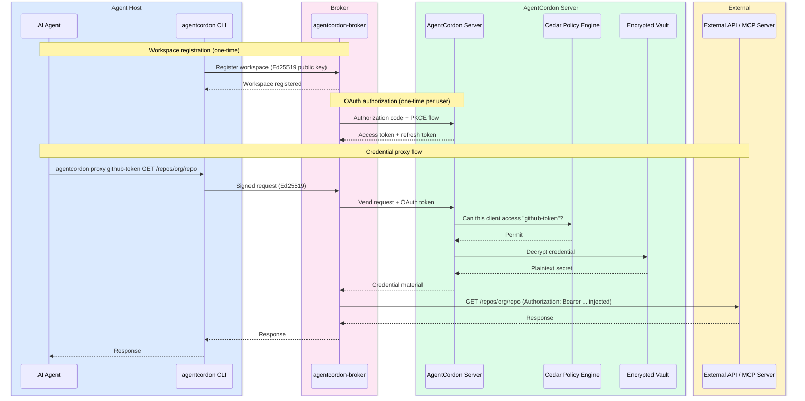

<picture>
  <source media="(prefers-color-scheme: dark)" srcset="docs/assets/banner-dark.svg">
  <source media="(prefers-color-scheme: light)" srcset="docs/assets/banner-light.svg">
  
</picture>

<h3 align="center">Your agents call APIs. They never see the keys.</h3>

<p align="center">
  <strong>AgentCordon</strong> is a self-hostable <strong>Agentic Identity Provider</strong> and credential broker for AI agents.<br/>
  AES-256-GCM encrypted vault &middot; Cedar policy engine &middot; credential proxy &middot; MCP gateway &middot; full audit trail.<br/>
  The open-source alternative to hardcoded API keys in AI agent workflows.
</p>

<p align="center">
  <a href="https://agentcordon.dev">Website</a> &middot;
  <a href="https://agentcordon.dev/docs">Docs</a> &middot;
  <a href="https://discord.gg/agentcordon">Discord</a>
</p>

---

## The Problem

AI agents need API keys. Most teams paste them into prompts, environment variables, or MCP config files. Every agent holds long-lived credentials with no access controls, no audit trail, and no revocation path. GitGuardian found 24,000+ secrets leaked in MCP config files alone. That doesn't scale.

## How AgentCordon Fixes It

AgentCordon uses a three-tier architecture: a **thin CLI** in each agent workspace talks to a **broker daemon** that holds OAuth tokens, and the broker talks to the **server** which enforces Cedar policies and manages the encrypted vault. Credentials never leave the broker boundary -- agents never see secrets.



## See It In Action

An AI agent checks a Cloudflare deployment and queries AWS IAM policies — using real credentials it never sees:

<p align="center">
  
</p>

<p align="center">
  
</p>

Every credential access shows up in the audit trail:

<p align="center">
  
</p>

## Quick Start

### 1. Start the server

```bash
docker compose up -d
```

Open [http://localhost:3140](http://localhost:3140). Default admin credentials are printed to the console on first boot.

### 2. Start the broker

The broker daemon runs on the user's machine (or as a shared service) and manages OAuth sessions with the server:

```bash
agentcordon-broker --server-url http://localhost:3140
```

The broker starts on port 3141 by default and opens a browser for OAuth consent on first run.

### 3. Register a workspace

From your agent's project directory:

```bash
agentcordon init
agentcordon register
```

### 4. Use credentials

```bash
agentcordon credentials                    # List available credentials
agentcordon proxy github-token GET /repos/org/repo   # Proxied API call
```

The CLI routes all requests through the broker. Credentials are injected server-side and never reach the agent.

### Production deployment

For production, set a persistent master secret and mount a data volume:

```bash
docker run -d \
  --name agentcordon \
  -p 3140:3140 \
  -e AGTCRDN_MASTER_SECRET="your-strong-secret-here" \
  -v agentcordon-data:/data \
  ghcr.io/agentcordon/agentcordon:latest
```

## Why AgentCordon

| Problem | Without AgentCordon | With AgentCordon |
|---------|-------------------|-----------------|
| **Credential storage** | API keys in `.env`, prompts, or MCP configs | AES-256-GCM encrypted vault with HKDF key derivation |
| **Access control** | None, or manual allow-lists | Cedar policy engine: deny-by-default, per-agent, deterministic |
| **Agent sees secrets?** | Yes, always | Never. Credential proxy injects server-side |
| **Audit trail** | Nonexistent | Every access logged with correlation IDs, SOC/IR ready |
| **MCP security** | Hardcoded secrets in config | Policy-controlled credential injection per tool call |
| **Revocation** | Find and rotate manually everywhere | One-click disable in dashboard, agents lose access instantly |

## Features

- **Credential proxy** -- agents call APIs through AgentCordon; raw tokens never leave the server
- **Cedar policy engine** -- deny-by-default, deterministic, testable authorization
- **Encrypted vault** -- AES-256-GCM, per-credential key derivation via HKDF
- **MCP gateway** -- proxy MCP tool calls with credential injection, policy enforcement, and response leak scanning
- **Broker daemon** -- per-user service that holds OAuth tokens and proxies upstream requests; credentials never reach agents
- **Workspace identity** -- Ed25519 keypairs, passwordless enrollment, per-project isolation
- **OAuth 2.0 authorization server** -- authorization code + PKCE (S256), client credentials grants, consent page, token refresh
- **OIDC / SSO** -- Google, Azure AD, Okta, any OpenID Connect provider
- **Audit trail** -- every access decision logged with correlation IDs, SOC/IR ready
- **Self-hosted first** -- Docker, Compose, Kubernetes, air-gap capable
- **AWS SigV4 signing** -- proxy signs requests so agents never see AWS access keys
- **Response leak scanning** -- outbound responses checked for credential exposure before reaching agents

## Building from Source

```bash
git clone https://github.com/agentcordon/agentcordon.git
cd agentcordon
cargo build --release
```

Produces three binaries in `target/release/`:

| Binary | Purpose |
|--------|---------|
| `agent-cordon-server` | Control plane server and OAuth authorization server (default port 3140) |
| `agentcordon-broker` | Broker daemon — holds OAuth tokens, vends credentials, proxies upstream requests (default port 3141) |
| `agentcordon` | Thin CLI for workspace agents — manages Ed25519 identity, signs requests to the broker |

## Configuration

Environment variables prefixed with `AGTCRDN_`:

| Variable | Default | Description |
|----------|---------|-------------|
| `AGTCRDN_PORT` | `3140` | Server listen port |
| `AGTCRDN_DB_PATH` | `./data/agent-cordon.db` | SQLite database path |
| `AGTCRDN_MASTER_SECRET` | auto-generated | Master encryption key (persist in production) |
| `AGTCRDN_ROOT_USERNAME` | auto-generated | Admin username |
| `AGTCRDN_ROOT_PASSWORD` | auto-generated | Admin password (printed on first boot) |
| `AGTCRDN_BROKER_PORT` | `3141` | Broker daemon listen port |
| `AGTCRDN_BROKER_URL` | — | Override broker URL |
| `AGTCRDN_OAUTH_AUTH_CODE_TTL` | `300` | OAuth authorization code TTL (seconds) |

## Project Structure

```
crates/
  core/       Domain types, Cedar policy engine, crypto (Ed25519, AES-256-GCM, HKDF), OAuth token storage
  server/     Axum HTTP server, OAuth authorization server, web dashboard, credential proxy, audit pipeline
  broker/     Broker daemon — OAuth token management, credential vending, upstream HTTP proxy
  cli/        Thin CLI — workspace identity (Ed25519), signed requests to the broker
migrations/   SQLite schema migrations
policies/     Default Cedar policy files
```

## Security

- **Deny by default.** All access requires an explicit Cedar policy grant.
- **Encrypted at rest.** AES-256-GCM with per-credential HKDF-derived keys.
- **No credential exposure.** Credentials stay within the broker boundary; agents never see secrets.
- **OAuth 2.0 with PKCE.** Authorization code flow with S256 challenge, consent page, and token refresh.
- **Ed25519 workspace identity.** No shared secrets between CLI and broker.
- **Full audit.** Every credential access, policy evaluation, and token operation is logged.

To report a vulnerability: [open a security issue](https://github.com/agentcordon/agentcordon/issues/new?template=security_report.yml)

## Contributing

Contributions welcome. Open an issue before submitting large changes.

```bash
cargo test --workspace
cargo clippy --workspace -- -D warnings
cargo fmt --all
```

---

<p align="center">
  <a href="https://getcordoned.sh">Website</a> &middot;
  <a href="https://github.com/agentcordon/agentcordon/issues">Issues</a> &middot;
  <a href="https://github.com/agentcordon/agentcordon/releases">Releases</a>
</p>
