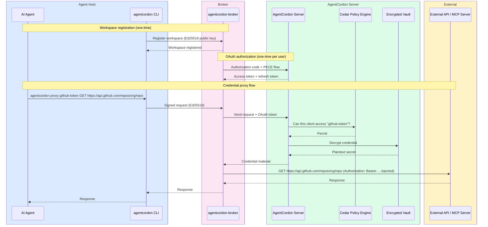

<picture>
  <source media="(prefers-color-scheme: dark)" srcset="docs/assets/banner-dark.svg">
  <source media="(prefers-color-scheme: light)" srcset="docs/assets/banner-light.svg">
  
</picture>

<h3 align="center">Your agents call APIs. They never see the keys.</h3>

<p align="center">
  <strong>AgentCordon</strong> is a self-hostable <strong>Agentic Identity Provider</strong> and credential broker for AI agents.<br/>
  AES-256-GCM encrypted vault &middot; Cedar policy engine &middot; credential proxy &middot; MCP gateway &middot; full audit trail.<br/>
  The open-source alternative to hardcoded API keys in AI agent workflows.
</p>

<p align="center">
  <a href="https://agentcordon.dev">Website</a> &middot;
  <a href="https://agentcordon.dev/docs">Docs</a> &middot;
  <a href="https://discord.gg/agentcordon">Discord</a>
</p>

---

## The Problem

AI agents need API keys. Most teams paste them into prompts, environment variables, or MCP config files. Every agent holds long-lived credentials with no access controls, no audit trail, and no revocation path. GitGuardian found 24,000+ secrets leaked in MCP config files alone. That doesn't scale.

## How AgentCordon Fixes It

AgentCordon uses a three-tier architecture: a **thin CLI** in each agent workspace talks to a **broker daemon** that holds OAuth tokens, and the broker talks to the **server** which enforces Cedar policies and manages the encrypted vault. Credentials never leave the broker boundary -- agents never see secrets.


```mermaid
sequenceDiagram
    box rgb(219,234,254) Agent Host
    participant Agent as AI Agent
    participant CLI as agentcordon CLI
    end
    box rgb(253,230,243) Broker
    participant Broker as agentcordon-broker
    end
    box rgb(220,252,231) AgentCordon Server
    participant Srv as AgentCordon Server
    participant Cedar as Cedar Policy Engine
    participant Vault as Encrypted Vault
    end
    box rgb(254,243,199) External
    participant Ext as External API / MCP Server
    end

    Note over Agent,Broker: Workspace registration (one-time)
    CLI->>Broker: Register workspace (Ed25519 public key)
    Broker-->>CLI: Workspace registered

    Note over Broker,Srv: OAuth authorization (one-time per user)
    Broker->>Srv: Authorization code + PKCE flow
    Srv-->>Broker: Access token + refresh token

    Note over Agent,Ext: Credential proxy flow
    Agent->>CLI: agentcordon proxy github-token GET https://api.github.com/repos/org/repo
    CLI->>Broker: Signed request (Ed25519)
    Broker->>Srv: Vend request + OAuth token
    Srv->>Cedar: Can this client access "github-token"?
    Cedar-->>Srv: Permit
    Srv->>Vault: Decrypt credential
    Vault-->>Srv: Plaintext secret
    Srv-->>Broker: Credential material
    Broker->>Ext: GET https://api.github.com/repos/org/repo (Authorization: Bearer ... injected)
    Ext-->>Broker: Response
    Broker-->>CLI: Response
    CLI-->>Agent: Response
```

## See It In Action

An AI agent checks a Cloudflare deployment and queries AWS IAM policies — using real credentials it never sees:

<p align="center">
  
</p>

<p align="center">
  
</p>

Every credential access shows up in the audit trail:

<p align="center">
  
</p>

## Prerequisites

| You want to | You need |
|-------------|----------|
| Run the server from a Compose file | **Docker with the Compose plugin.** Check with `docker compose version`. The plugin is a separate install from the Docker engine on many distributions; without it, use the `docker run` form below. |
| Run the server without Compose | **Docker** alone (`docker --version`), driven with `docker run` — see [Quick Start (c)](#1-start-the-server) and [Production deployment](#production-deployment). From a clone, build the image first (`docker build -t agentcordon:local .`) so it matches the tree you are on; the published `:latest` tag may be older. |
| Build the server, CLI or broker from source | **A Rust toolchain** (stable, edition 2021 or later) — see [Building from Source](#building-from-source). Nothing else: there are no system libraries to hunt down. |
| Approve a workspace enrollment | **A browser**, on any machine that can reach the server. The device flow is copy-a-code-and-click-Approve; there is no loopback callback to forward. |

Every example below assumes the server is reachable on port **3140**, its default. Change it
with `AGTCRDN_LISTEN_ADDR` (the binary's listen address) or, under Compose, with
`AGTCRDN_PORT` (the *host* side of the published mapping) — and translate the URLs to match.

## Quick Start

### 1. Start the server

Pick whichever of these matches what you have. All three run the same server.

**(a) From a clone of this repository** — builds the image locally, so it always matches the
tree you are on:

```bash
git clone https://github.com/agentcordon/agentcordon.git
cd agentcordon
docker compose -f docker-compose.build.yml up -d --build
```

**(b) From the published image** — no clone, once a release image exists for the version you
want. `docker-compose.yml` pulls `ghcr.io/agentcordon/agentcordon:latest`; if that tag does
not exist yet for your version, Compose fails on the pull and you want (a) or (c):

```bash
docker compose up -d
```

**(c) Without the Compose plugin** — plain `docker run`, the same volume and port the
Compose files use. This is the [production form](#production-deployment) with the extras
left off.

*From a clone*, build the image first, so it matches the tree you are on — the `docker run`
equivalent of (a):

```bash
git clone https://github.com/agentcordon/agentcordon.git
cd agentcordon
docker build -t agentcordon:local .
docker run -d --name agentcordon -p 3140:3140 \
  -v agentcordon-data:/data \
  agentcordon:local
```

*Without a clone*, run the published image. Heed the same caveat (b) carries, one step
further: `:latest` is the tag that always exists, so unlike (b) **nothing fails** — it
pulls, it starts, and it may be an **older** server than the release you are following,
which you then meet as a version mismatch against the installer or the CLI. Build from the
clone whenever you have one:

```bash
docker run -d --name agentcordon -p 3140:3140 \
  -v agentcordon-data:/data \
  ghcr.io/agentcordon/agentcordon:latest
```

Open [http://localhost:3140](http://localhost:3140). Default admin credentials are printed to the console on first boot.
[Admin UI](docs/admin-ui.md) maps every screen in the console.

> **Running two stacks on one host?** Neither Compose file sets `container_name`, so the
> container and volume names come from the Compose project name — the directory name by
> default. Give each stack its own project name and host port:
> `COMPOSE_PROJECT_NAME=agentcordon-staging AGTCRDN_PORT=3141 docker compose up -d`.

> **Set `AGTCRDN_BASE_URL` before anyone enrolls.** The server builds the device-flow
> activation URL and the `GET /install.sh` script from it. With it unset the server falls
> back to `http://` plus its listen address, which in the shipped container is
> `http://0.0.0.0:3140` — an address no browser can open. Put the URL your users actually
> reach the server on into `.env` and restart:
>
> ```bash
> echo 'AGTCRDN_BASE_URL=https://agentcordon.example.com' >> .env
> docker compose up -d           # or: -f docker-compose.build.yml up -d
> ```
>
> On the `docker run` path (c) there is no `.env`; replace the container instead, adding
> `-e`. This is lossless — the database, the generated `.secret` and the first-boot
> `.root_password` all live in the named volume, which the new container re-attaches, so
> your users, credentials and admin password survive:
>
> ```bash
> docker rm -f agentcordon
> docker run -d --name agentcordon -p 3140:3140 \
>   -e AGTCRDN_BASE_URL=https://agentcordon.example.com \
>   -v agentcordon-data:/data \
>   agentcordon:local          # or ghcr.io/agentcordon/agentcordon:latest
> ```

### 2. Install the CLI and the broker

`agentcordon` (the workspace CLI) and `agentcordon-broker` (the per-user daemon) are two
static binaries. Your server serves an installer for them:

```bash
curl -fsSL https://agentcordon.example.com/install.sh | sh
```

It detects your OS and architecture, downloads both binaries from the matching GitHub
release, **verifies them against the release's `SHA256SUMS`**, and installs them to
`~/.local/bin`. It works under `sh`, `bash`, `dash` and `zsh`; nothing is re-downloaded
from a second URL, so it also works on a server reachable only at an address the
AgentCordon server does not know about.

<details>
<summary>Without a server, or on Windows</summary>

**Linux / macOS, straight from GitHub Releases** — pick the target triple for your machine
(`x86_64-unknown-linux-gnu`, `aarch64-unknown-linux-gnu`, `x86_64-apple-darwin`,
`aarch64-apple-darwin`):

```bash
base=https://github.com/agentcordon/agentcordon/releases/latest/download
target=aarch64-apple-darwin
curl -fsSL "$base/agentcordon-$target"        -o ~/.local/bin/agentcordon
curl -fsSL "$base/agentcordon-broker-$target" -o ~/.local/bin/agentcordon-broker
curl -fsSL "$base/SHA256SUMS"                 -o /tmp/SHA256SUMS
chmod +x ~/.local/bin/agentcordon ~/.local/bin/agentcordon-broker
```

**Windows 10 / 11** — see [Installing on Windows](#installing-on-windows) below.

**From source** — see [Building from Source](#building-from-source).

</details>

### 3. Start the broker

The broker daemon runs on the user's machine (or as a shared service) and manages OAuth sessions with the server:

```bash
agentcordon-broker --server-url http://localhost:3140
```

The broker binds `127.0.0.1` on an **auto-selected port** and writes the URL it chose to
`~/.agentcordon/broker.port`. The CLI reads that file, so you do not have to know or set
the port. `AGTCRDN_BROKER_PORT` pins a fixed port if you want one; `AGTCRDN_BROKER_URL`
overrides discovery entirely and is only needed when the CLI and the broker are on
different hosts or in different containers.

The broker does not enroll anything by itself. On first run it generates its keypair, finds
it has no workspace tokens, and sits listening — no code, no prompt, nothing to approve. The
device flow starts in step 4, when `agentcordon register` asks for a code and prints the
4-word passphrase plus the activation URL. You approve that in any browser, on any host;
there is no loopback callback and no ephemeral port to forward.

Leave the broker running in its own terminal (or under a service manager) and move on.

### 4. Set up a workspace

From your agent's project directory, initialize the workspace and register it with the broker:

```bash
agentcordon init
agentcordon register --server-url https://agentcordon.example.com
```

You will see something like:

```

! First, copy your one-time code: tidy-zoned-zit-ramp

Then open this URL in your browser:
  https://agentcordon.example.com/activate

Or use this link to skip typing the code:
  https://agentcordon.example.com/activate?user_code=tidy-zoned-zit-ramp

Waiting for approval... (expires in 10 minutes)
```

Open either URL in any browser (including one on a completely different
machine), sign in, paste the 4-word code if you used the plain one, and click
**Approve**. The CLI
will detect the approval and finish registering the workspace with the
broker. If no broker is running yet, `agentcordon register --server-url`
auto-starts one for you before kicking off the device flow.

This uses [RFC 8628 OAuth 2.0 Device Authorization Grant](https://datatracker.ietf.org/doc/html/rfc8628),
the same flow as `gh auth login`, `az login --use-device-code`, and
`aws sso login`. The broker can run on a remote host, inside a container,
or on a headless server without any port forwarding.

<details>
<summary>Manual setup (advanced)</summary>

If you already have a broker running and want to skip the auto-start step:

```bash
agentcordon init                 # Generate Ed25519 keypair + agent instruction files
agentcordon register             # Start the device flow (uses the running broker)
```

</details>

### Installing on Windows

On Windows 10 / 11, the fastest way to install both the CLI and the broker
is the one-liner PowerShell installer served by your AgentCordon server:

```powershell
irm https://your-server.example.com/install.ps1 | iex
```

This downloads `agentcordon.exe` and `agentcordon-broker.exe` from the
matching GitHub release, verifies them against the release's `SHA256SUMS`,
installs them to `%LOCALAPPDATA%\AgentCordon\bin`, and adds that directory
to your user PATH. No admin rights required, no Windows service — the broker
runs in the terminal you started it from and exits when that terminal
closes, just like on Unix.

If your server does not serve the installer, download the two
`*-x86_64-pc-windows-msvc.exe` assets and `SHA256SUMS` from
[the latest release](https://github.com/agentcordon/agentcordon/releases/latest)
and check them yourself:

```powershell
Get-FileHash .\agentcordon-x86_64-pc-windows-msvc.exe -Algorithm SHA256
```

After the installer finishes, open a new terminal and run:

```powershell
agentcordon-broker --server-url https://your-server.example.com
agentcordon init
agentcordon register --server-url https://your-server.example.com
```

The device flow works identically on Windows — copy the 4-word code into
a browser and approve.

### 5. Use credentials

```bash
agentcordon credentials                                                    # List available credentials
agentcordon proxy github-token GET https://api.github.com/repos/org/repo   # Proxied API call
```

`agentcordon proxy` takes a **full URL**, not a path — the broker needs the origin to check
the credential's `allowed_url_pattern` and to run its SSRF check.

### 6. Use MCP tools

```bash
agentcordon mcp-servers                    # List available MCP servers
agentcordon mcp-tools                      # Discover tools across all servers
agentcordon mcp-call github list_repos --arg owner=myorg  # Call an MCP tool
```

The CLI routes all requests through the broker. Credentials are injected server-side and never reach the agent.

### Production deployment

For production, set a persistent master secret and mount a data volume:

```bash
docker run -d \
  --name agentcordon \
  -p 3140:3140 \
  -e AGTCRDN_MASTER_SECRET="$(openssl rand -hex 32)" \
  -e AGTCRDN_BASE_URL="https://agentcordon.example.com" \
  -v agentcordon-data:/data \
  ghcr.io/agentcordon/agentcordon:latest
```

**From a clone, build the image instead of pulling it.** `:latest` is the only tag that
reliably exists, and it may be an **older** server than the tree or release you are
deploying — the pull succeeds either way, so the mismatch shows up later, against the
installer or the CLI. Same recipe, one extra step and a different final argument:

```bash
docker build -t agentcordon:local .
docker run -d \
  --name agentcordon \
  -p 3140:3140 \
  -e AGTCRDN_MASTER_SECRET="$(openssl rand -hex 32)" \
  -e AGTCRDN_BASE_URL="https://agentcordon.example.com" \
  -v agentcordon-data:/data \
  agentcordon:local
```

`docker-compose.build.yml` is the Compose form of the same thing.

Two things this example does not do for you:

- **Terminate TLS.** The admin session cookie is `Secure`, so a browser will keep it only
  over HTTPS or on `127.0.0.1`. Reached at `http://<lan-ip>:3140`, login appears to succeed
  and then bounces back to the login page. Put the server behind a TLS-terminating reverse
  proxy (and set `AGTCRDN_TRUST_FORWARDED_HEADERS=true` there) or give it a certificate.
- **Set the base URL for you.** `AGTCRDN_BASE_URL` must be the URL your users type. Without
  it the activation URL and `install.sh` point at the container's bind address.

## Why AgentCordon

| Problem | Without AgentCordon | With AgentCordon |
|---------|-------------------|-----------------|
| **Credential storage** | API keys in `.env`, prompts, or MCP configs | AES-256-GCM encrypted vault with HKDF key derivation |
| **Access control** | None, or manual allow-lists | Cedar policy engine: deny-by-default, per-agent, deterministic |
| **Agent sees secrets?** | Yes, always | Never. Credential proxy injects server-side |
| **Audit trail** | Nonexistent | Every access logged with correlation IDs, SOC/IR ready |
| **MCP security** | Hardcoded secrets in config | Policy-controlled credential injection per tool call |
| **Revocation** | Find and rotate manually everywhere | **Disable** a workspace from its page and agents lose access instantly; **Revoke**, in the same page's overflow menu, is the one-way version — it kills the workspace's OAuth clients and every access and refresh token in one transaction |

## Features

- **Credential proxy** -- agents call APIs through AgentCordon; raw tokens never leave the server
- **Cedar policy engine** -- deny-by-default, deterministic, testable authorization
- **Encrypted vault** -- AES-256-GCM, per-credential key derivation via HKDF
- **Vaults** -- named, owned groupings for credentials, created and managed from Settings &rarr; Vaults, shareable read-only with another user (they see what is in the vault, never a secret). Every credential lives in exactly one; the system `default` vault is the one everybody uses. See [Credential Encryption &sect; Vaults](docs/credential-encryption.md#vaults)
- **MCP gateway** -- proxy MCP tool calls with credential injection, policy enforcement, and response leak scanning
- **MCP Marketplace** -- one-click installation of popular MCP servers (GitHub, Slack, Linear, etc.) with automatic credential binding. Install once, then share the same MCP with any of your workspaces from the **Access** tab on its detail page — one record, many bindings, same credentials everywhere.
- **OAuth2 for MCP servers** -- authorization code flow support for MCP servers that require OAuth2 authentication
- **Broker daemon** -- per-user service that holds OAuth tokens and proxies upstream requests; credentials never reach agents
- **Workspace identity** -- Ed25519 keypairs, passwordless enrollment, per-project isolation
- **OAuth 2.0 authorization server** -- authorization code + PKCE (S256), client credentials grants, consent page, token refresh
- **OIDC / SSO** -- Google, Azure AD, Okta, any OpenID Connect provider
- **Audit trail** -- every access decision logged with correlation IDs, SOC/IR ready
- **Self-hosted first** -- Docker, Compose, Kubernetes, air-gap capable
- **AWS SigV4 signing** -- proxy signs requests so agents never see AWS access keys
- **Response leak scanning** -- outbound responses checked for credential exposure before reaching agents

## Building from Source

```bash
git clone https://github.com/agentcordon/agentcordon.git
cd agentcordon
cargo build --release
```

Produces three binaries in `target/release/`:

| Binary | Purpose |
|--------|---------|
| `agent-cordon-server` | Control plane server and OAuth authorization server (default port 3140) |
| `agentcordon-broker` | Broker daemon — holds OAuth tokens, vends credentials, proxies upstream requests (binds `127.0.0.1` on an auto-selected port; see `AGTCRDN_BROKER_PORT`) |
| `agentcordon` | Thin CLI for workspace agents — manages Ed25519 identity, signs requests to the broker |

## Configuration

Environment variables prefixed with `AGTCRDN_`:

### Server

| Variable | Default | Description |
|----------|---------|-------------|
| `AGTCRDN_LISTEN_ADDR` | `0.0.0.0:3140` | Address and port the server binds. **This, not `AGTCRDN_PORT`, is the server's listen setting.** |
| `AGTCRDN_BASE_URL` | — | The URL users reach this server on. The device-flow activation URL, the OAuth2 MCP callback redirect URI, and `GET /install.sh` are all built from it. Unset, there are two fallbacks and neither is good: the activation URL and the redirect URI use `http://` + `AGTCRDN_LISTEN_ADDR` (in a container, `http://0.0.0.0:3140`, which no browser can open), while `/install.sh` and `/install.ps1` use the request's own `Host` with the scheme from `X-Forwarded-Proto`, defaulting to `http` when no proxy sends that header — so a TLS deployment that does not set this variable **must** have its reverse proxy send `X-Forwarded-Proto: https`, or the emitted installer points at `http://`. **Set it.** |
| `AGTCRDN_DB_PATH` | `./data/agent-cordon.db` | SQLite database path. SQLite is the only storage backend. |
| `AGTCRDN_MASTER_SECRET` | auto-generated | Master encryption key (persist in production) |
| `AGTCRDN_MASTER_KEY_VERSION` | `1` | Version number of the current master secret ([rotation](docs/master-key.md)) |
| `AGTCRDN_PREVIOUS_MASTER_SECRET` | — | The secret for version N-1, set only during a rotation |
| `AGTCRDN_KDF_SALT` | auto-derived per secret | HKDF salt override, applied to the current and previous master secret alike. Unset, each secret derives its own salt, which is the safe default; once set it must stay set, including through a [rotation](docs/master-key.md#key-rotation) |
| `AGTCRDN_ARGON2_M_COST_KIB` | `65536` | Argon2id memory cost in KiB. Applies to master-secret stretching, password hashing and secret hashing alike |
| `AGTCRDN_ARGON2_T_COST` | `3` | Argon2id iterations |
| `AGTCRDN_ARGON2_P_COST` | `4` | Argon2id lanes |
| `AGTCRDN_ROOT_USERNAME` | auto-generated | Admin username |
| `AGTCRDN_ROOT_PASSWORD` | auto-generated | Admin password (printed on first boot) |
| `AGTCRDN_LOG_LEVEL` | `info` | Logging level (trace, debug, info, warn, error) |
| `AGTCRDN_LOG_FORMAT` | `json` | Log output format (json or pretty) |
| `AGTCRDN_SESSION_TTL` | `28800` | Session TTL in seconds (default: 8 hours) |
| `AGTCRDN_AUTH_CODE_TTL` | `600` | OAuth authorization code TTL (seconds) |
| `AGTCRDN_DEVICE_CODE_TTL_SECS` | `600` | Device code TTL (clamped 30–3600) |
| `AGTCRDN_DEVICE_CODE_POLL_INTERVAL_SECS` | `5` | Device flow poll interval (clamped 1–60) |
| `AGTCRDN_PROXY_ALLOW_LOOPBACK` | `false` | **Turns the SSRF guard off**, not just the loopback rule. Every private and reserved range (RFC 1918, CGNAT, link-local, the TEST-NETs, 240/4, NAT64, 6to4 …) becomes a reachable proxy target. On the *server* this covers MCP tool discovery and OAuth discovery; the broker has its own copy of the variable for `proxy` and `mcp-call`. Development only. |
| `AGTCRDN_REPLICA_MODE` | `single` | `unsafe-shared` disables the single-instance database guard |
| `AGTCRDN_TRUST_FORWARDED_HEADERS` | `false` | Trust `X-Forwarded-For` for per-address limits. Only behind a proxy that overwrites it. |
| `AGTCRDN_MCP_TEMPLATES_DIR` | — | Directory of extra MCP marketplace templates, merged with the built-in catalog at startup. **The only way to add your own MCP server to the marketplace.** Read once at startup — restart after editing a template. |
| `AGTCRDN_CREDENTIAL_TEMPLATES_DIR` | — | Same, for credential templates |
| `AGTCRDN_POLICY_TEMPLATES_DIR` | — | Same, for policy templates |
| `AGTCRDN_INSTANCE_LABEL` | `AgentCordon` | `client_name` sent in OAuth Dynamic Client Registration |

`AGTCRDN_PORT` is **not** read by the server. It appears in the shipped `docker-compose.yml`
as the *host* side of the published port mapping (`"${AGTCRDN_PORT:-3140}:3140"`) and has no
effect on a plain `docker run` or on the binary.

### Broker (`agentcordon-broker`)

| Variable | Default | Description |
|----------|---------|-------------|
| `AGTCRDN_SERVER_URL` | `http://localhost:3140` | The AgentCordon server the broker talks to |
| `AGTCRDN_BROKER_PORT` | `0` (auto-select) | Broker listen port. `0` means "pick a free one and write it to `~/.agentcordon/broker.port`", which is how the CLI finds it. |
| `AGTCRDN_BROKER_BIND` | `127.0.0.1` | Bind address. A non-loopback bind is refused unless TLS or a shared secret is configured. |
| `AGTCRDN_BROKER_SHARED_SECRET` | — | Secret every request must present in `X-AgentCordon-Broker-Secret`; also read by the CLI |
| `AGTCRDN_BROKER_TLS_CERT` / `..._TLS_KEY` | — | PEM pair; the broker then serves HTTPS itself |
| `AGTCRDN_DATA_DIR` (`--data-dir`) | `~/.agentcordon` | Directory for the broker's keys, tokens and runtime files (`broker.key`, `tokens.enc`, `workspaces.json`, `broker.port`, `broker.pid`, `broker.lock`). Set it for a second broker on one host, a service account with no home directory, or an XDG-tidy install. **The CLI does not read this variable** — it always looks for `~/.agentcordon/broker.port`, so a broker on a non-default data directory is invisible to auto-discovery and the CLI needs `AGTCRDN_BROKER_URL` pointed at it. |
| `AGTCRDN_MCP_SYNC_INTERVAL` | `60` | MCP config sync interval, seconds |
| `AGTCRDN_PROXY_ALLOW_LOOPBACK` | `false` | Same meaning as above, on the broker's own outbound calls: `agentcordon proxy` and `agentcordon mcp-call`. **Set on the server as well** if a private upstream also has to be reached during MCP tool discovery or OAuth discovery — see the note below. |

#### `AGTCRDN_PROXY_ALLOW_LOOPBACK` is two variables, not one

The server and the broker each read it, each for their own outbound calls, and setting it on
one does nothing for the other:

| Set on | Covers |
|--------|--------|
| **Broker** | `agentcordon proxy` (`/proxy`) and `agentcordon mcp-call` — every call the broker makes to your API or your MCP server with a credential injected |
| **Server** | MCP tool discovery (the `initialize` / `tools/list` probe a marketplace install runs against the upstream URL) and OAuth discovery (the MCP endpoint's 401 probe, the RFC 9728 protected-resource document, and the RFC 8414 authorization-server metadata) |

An upstream on a private or loopback address needs **both**: without the broker's copy the
call is refused at `proxy` time; without the server's, a marketplace install still reports
success but discovers no tools. Separately, an `oauth2_client_credentials` token endpoint on
plain HTTP is governed by its own rule — HTTPS required, with the literal hosts `localhost`,
`127.0.0.1` and `::1` exempt — which this variable does not affect.

There is no allow-list form. The guard is all-or-nothing: one variable, every private and
reserved range at once.

### CLI (`agentcordon`)

| Variable | Default | Description |
|----------|---------|-------------|
| `AGTCRDN_BROKER_URL` | auto-discovered from `~/.agentcordon/broker.port` | **Override only.** Must be plain `http://` to a loopback host, or any `https://` URL. Also the way to reach a broker started with `--data-dir` / `AGTCRDN_DATA_DIR`, whose port file the CLI never looks at. |
| `AGTCRDN_BROKER_SHARED_SECRET` | — | Sent as `X-AgentCordon-Broker-Secret` when the broker requires one |
| `AGTCRDN_BROKER_CA` | — | Extra PEM trust anchor for a broker serving its own certificate |
| `AGTCRDN_LOG_LEVEL` | `warn` | CLI log filter |

The full list, with everything the templates and rotation runbook need, is in
[docs/upgrading.md § Environment Variable Reference](docs/upgrading.md#environment-variable-reference).

## Project Structure

```
crates/
  core/       Domain types, Cedar policy engine, crypto (AES-256-GCM key ring, ECIES, HKDF), storage, SSRF and URL-pattern checks
  server/     Axum HTTP server, OAuth authorization server, web dashboard, credential proxy, audit pipeline
  broker/     Broker daemon — OAuth token management, credential vending, upstream HTTP proxy, MCP gateway
  cli/        Thin CLI — workspace identity, signed requests to the broker
  identity/   Ed25519 key file, `sha256:` identity, request and register signing — shared by the CLI and the broker
migrations/   SQLite schema migrations
policies/     Default Cedar policy files
data/         Built-in credential, MCP and policy templates
```

## Security

- **Deny by default.** All access requires an explicit Cedar policy grant.
- **Encrypted at rest.** AES-256-GCM with per-credential HKDF-derived keys.
- **No credential exposure.** Credentials stay within the broker boundary; agents never see secrets.
- **OAuth 2.0 with PKCE.** Authorization code flow with S256 challenge, consent page, and token refresh.
- **Ed25519 workspace identity.** No shared secrets between CLI and broker.
- **Full audit.** Every credential access, policy evaluation, and token operation is logged.

To report a vulnerability: [open a security issue](https://github.com/agentcordon/agentcordon/issues/new?template=security_report.yml)

## Documentation

- [Admin UI](docs/admin-ui.md) -- a map of the browser console: every screen, its primary action, and what is behind each overflow menu
- [Workspace Enrollment](docs/workspace-enrollment.md) -- Ed25519 identity, the device-code flow, the approval screens
- [Granting MCP Server Access](docs/granting-mcp-server-access.md) -- installing an MCP server, marketplace templates, OAuth provider clients
- [Authorization & Cedar Policy](docs/authorization-and-cedar-policy.md) -- entity types, the default policy, the policy pages and tester
- [Credential Encryption](docs/credential-encryption.md) -- AES-256-GCM at rest, ECIES vending, transforms, vaults
- [Master Key](docs/master-key.md) -- key derivation, rotation, re-sealing
- [CLI Reference](docs/cli-reference.md) -- every command and flag
- [System Architecture](docs/system-architecture.md) -- crates, routes, middleware, data flow
- [Upgrading](docs/upgrading.md) -- migrations, backups, rollback
- [Releasing](docs/releasing.md) -- cutting a release: one `cargo release` command, what the pushed tag builds, pre-releases

## Contributing

Contributions welcome. Open an issue before submitting large changes.

```bash
cargo test --workspace
cargo clippy --workspace -- -D warnings
cargo fmt --all
```

---

<p align="center">
  <a href="https://getcordoned.sh">Website</a> &middot;
  <a href="https://github.com/agentcordon/agentcordon/issues">Issues</a> &middot;
  <a href="https://github.com/agentcordon/agentcordon/releases">Releases</a>
</p>
