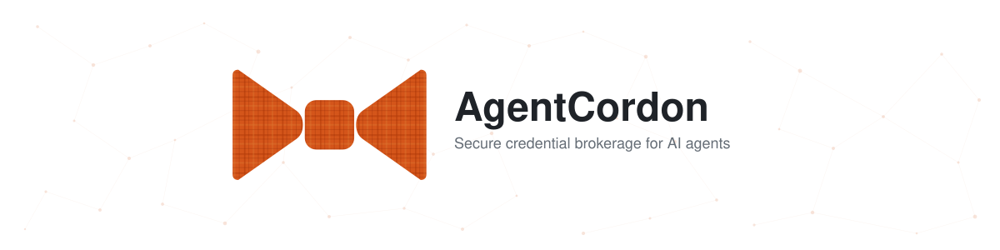
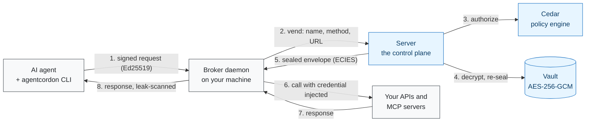
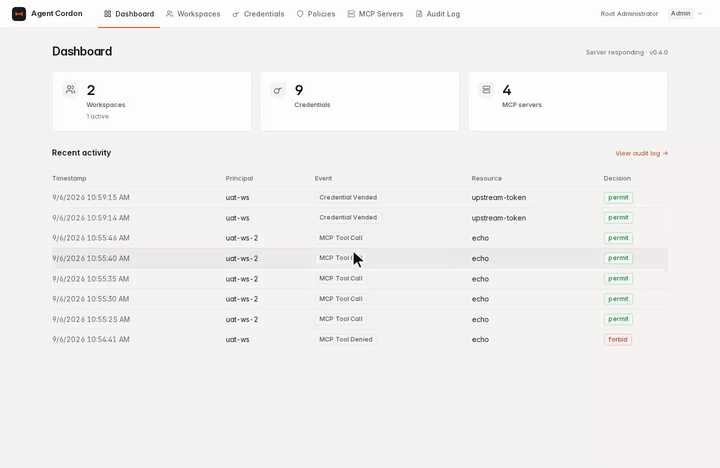

<picture>
  <source media="(prefers-color-scheme: dark)" srcset="docs/assets/banner-dark.svg">
  <source media="(prefers-color-scheme: light)" srcset="docs/assets/banner-light.svg">
  
</picture>

<p align="center">
  <a href="https://github.com/agentcordon/agentcordon/actions/workflows/ci.yml"></a>
  <a href="https://github.com/agentcordon/agentcordon/releases/latest"></a>
  <a href="LICENSE"></a>
</p>

**AgentCordon is a self-hosted credential broker for AI agents.** An agent asks for an API
call by name; AgentCordon decides whether it is allowed, injects the credential, makes the
call, and hands back the response with any leaked secret scrubbed out. The agent never
holds the key. It is for teams running agents against real APIs who want one place to grant,
revoke and audit that access.

## The problem

Agents need API keys, so the keys end up in prompts, environment variables and MCP config
files. Each one is long-lived, copied into several places, readable by whatever the agent
reads, and invisible once it leaves. There is no per-agent scope, no record of use, and no
way to cut one agent off without rotating a secret everywhere it was pasted.

## The model

Three processes, and a boundary the secret does not cross.

The **CLI** in each project directory has an Ed25519 keypair and no credentials. It signs
every request to the **broker**, a daemon on the same machine that holds the workspace's
OAuth tokens but no provider secrets. The broker asks the **control plane** — the server —
for one credential, naming the method and URL it is about to call. The server evaluates
Cedar policy, opens the credential from its encrypted vault, and re-seals it for that
broker alone. The broker injects it, makes the call, and scans the response on the way back.

Grants are per workspace and per credential, and a credential can name the URLs it may be
sent to. Cutting an agent off is a switch on its workspace page, not a rotation.


```mermaid
flowchart LR
    Agent["AI agent<br/>+ agentcordon CLI"]
    Broker["Broker daemon<br/>on your machine"]
    Server["Server<br/>the control plane"]
    Cedar["Cedar<br/>policy engine"]
    Vault[("Vault<br/>AES-256-GCM")]
    Upstream["Your APIs and<br/>MCP servers"]

    Agent -- "1. signed request (Ed25519)" --> Broker
    Broker -- "2. vend: name, method, URL" --> Server
    Server -- "3. authorize" --> Cedar
    Server -- "4. decrypt, re-seal" --> Vault
    Server -- "5. sealed envelope (ECIES)" --> Broker
    Broker -- "6. call with credential injected" --> Upstream
    Upstream -- "7. response" --> Broker
    Broker -- "8. response, leak-scanned" --> Agent

    classDef agentside fill:#f8f9fa,stroke:#495057,color:#212529
    classDef secrets fill:#e7f5ff,stroke:#1971c2,color:#0b3d66
    class Agent,Broker,Upstream agentside
    class Server,Cedar,Vault secrets
```

Blue is the control plane: the only place a stored secret exists in plaintext. The envelope
in step 5 is sealed to the broker's own key and bound to that one vend. For the upstream
OAuth credential types the plaintext never even reaches the broker — the server runs the
provider's token exchange itself and seals only a short-lived access token.

The vend at step 2 and the policy decision at step 3 are each an audit row, correlated.
[System Architecture](docs/system-architecture.md#data-flow) draws the same path in full,
with every check in the order the code runs it.

## See it in action

Every credential access, and the policy decision behind it, in the audit log:

<p align="center">
  
</p>

## Quick start

Start the server, install the client binaries, start the broker, enroll a workspace, make a
call. Everything below assumes port **3140**, the server's default.

### 1. Start the server

```bash
docker run -d --name agentcordon -p 3140:3140 \
  -v agentcordon-data:/data \
  ghcr.io/agentcordon/agentcordon:0.4.0
```

Open <http://localhost:3140>. The admin username is `root`; the password is generated on
first boot and printed once to the container log (`docker logs agentcordon`).

> **Set `AGTCRDN_BASE_URL` before anyone enrolls.** The server builds the device-flow
> activation URL and the `GET /install.sh` script from it. Unset, it falls back to `http://`
> plus its listen address, which in the shipped container is `http://0.0.0.0:3140` — an
> address no browser can open. Replace the container, adding `-e
> AGTCRDN_BASE_URL=https://agentcordon.example.com`. Nothing is lost: the database, the
> generated `.secret` and the first-boot `.root_password` all live in the named volume.

[Installation](docs/installation.md) covers Docker Compose, a build from a clone, the
Tailscale sidecar, and a source build. [Deployment](docs/deployment.md) covers the
production shape.

### 2. Install the CLI and the broker

`agentcordon` and `agentcordon-broker` are static binaries. Your server serves an installer
for them, pinned to its own version:

```bash
curl -fsSL https://agentcordon.example.com/install.sh | sh
```

It detects your OS and architecture, downloads both binaries from the matching GitHub
release, verifies them against the release's `SHA256SUMS`, and installs them to
`~/.local/bin`. On Windows, `irm https://agentcordon.example.com/install.ps1 | iex`.
[Installation](docs/installation.md#the-cli-and-the-broker) has the manual routes.

### 3. Start the broker

```bash
agentcordon-broker --server-url https://agentcordon.example.com
```

It binds `127.0.0.1` on a port it picks and writes the URL to `~/.agentcordon/broker.port`,
which is how the CLI finds it. Leave it running in its own terminal, or under a service
manager. It asks for nothing on first run; enrollment is the next step.

### 4. Enroll a workspace

From your agent's project directory:

```bash
agentcordon init
agentcordon register --server-url https://agentcordon.example.com
```

`register` prints a four-word code and an activation URL. Open it in any browser, on any
machine, sign in, and click **Approve**. This is the
[RFC 8628 device authorization grant](https://datatracker.ietf.org/doc/html/rfc8628), the
same flow as `gh auth login` — there is no loopback callback and nothing to port-forward.
If no broker is running, `register --server-url` starts one first.

### 5. Use it

```bash
agentcordon credentials                                                    # what this workspace may use
agentcordon proxy github-token GET https://api.github.com/repos/org/repo   # a proxied call
agentcordon mcp-tools                                                      # tools across every bound MCP server
agentcordon mcp-call github list_repos --arg owner=myorg                   # one tool call
```

`proxy` takes a full URL, not a path: the broker needs the origin to check the credential's
URL pattern and to run its SSRF check. [CLI Reference](docs/cli-reference.md) has every
command and flag.

## Features

- **Credential proxy.** Agents call APIs by credential name. The credential is injected in
  the broker and never reaches the agent.
- **Cedar policy engine.** Deny by default. Grants are per workspace, per credential, per
  action, with a tester page that shows which rules decided.
- **Encrypted vault.** AES-256-GCM at rest under a versioned master key, with a re-seal
  path for rotation and per-vend ECIES envelopes to the broker.
- **Vaults.** Named, owned groupings for credentials, shareable read-only with another
  user, who sees what is in the vault and never a secret.
- **URL-fenced credentials.** A credential can name the URLs it may be sent to. The pattern
  is checked structurally on the server at vend time and again in the broker before
  injection.
- **MCP servers.** Install one from the marketplace, bind it to any of your workspaces, and
  let the broker front it. Tool calls are policy-checked per call and leak-scanned on the
  way back.
- **OAuth 2.0 for MCP.** Discovery, dynamic client registration and the authorization-code
  flow with PKCE, so an MCP server that needs a delegated token gets one — refreshed
  server-side, so the refresh token never leaves the control plane.
- **Workspace identity.** One project directory, one Ed25519 keypair, one set of grants.
  Enrollment is a device flow approved in a browser; there is no password and no shared
  secret.
- **OIDC sign-in.** The admin console accepts any OpenID Connect provider for SSO.
- **AWS SigV4.** An AWS credential is signed as a SigV4 request rather than injected as a
  header, so an agent gets a signed call and never an access key.
- **Response leak scanning.** Anything injected is scrubbed out of what comes back — raw,
  base64, URL-safe base64 or percent-encoded.
- **Audit trail.** Every vend, policy decision and token operation is an append-only row
  with a correlation id, exportable as CSV, syslog or JSONL.
- **Self-hosted.** One binary, one SQLite file, a multi-arch container image, no external
  services.

## Security

Deny by default: every access needs an explicit Cedar grant, and a policy that errors is
treated as a denial rather than skipped. Credentials are AES-256-GCM encrypted at rest and
released only as a single-use ECIES envelope sealed to one broker's key. The CLI signs
every request to the broker with Ed25519 over a nonce the broker will not accept twice. A
resolving SSRF check refuses every reserved address range in front of each outbound call,
and the leak scanner strips injected values out of every response. Upstream OAuth secrets —
provider client secrets and refresh tokens — never leave the server.

[Authorization & Cedar Policy](docs/authorization-and-cedar-policy.md),
[Credential Encryption](docs/credential-encryption.md) and [Master Key](docs/master-key.md)
go through each of these. To report a vulnerability,
[open a security issue](https://github.com/agentcordon/agentcordon/issues/new?template=security_report.yml).

## Documentation

| Page | What is in it |
|---|---|
| [Documentation index](docs/index.md) | Everything below, grouped |
| [Installation](docs/installation.md) | Every way to install the server, the CLI and the broker, including Windows and a source build |
| [Configuration](docs/configuration.md) | Every environment variable for all three binaries, with defaults |
| [Deployment](docs/deployment.md) | Reverse proxy, base URL, volumes, the single-instance lock, backups |
| [Workspace Enrollment](docs/workspace-enrollment.md) | Ed25519 identity, the device-code flow, the approval screens |
| [Admin UI](docs/admin-ui.md) | A map of the console: every screen and what is behind each menu |
| [Granting MCP Server Access](docs/granting-mcp-server-access.md) | Installing an MCP server, marketplace templates, OAuth provider clients |
| [Authorization & Cedar Policy](docs/authorization-and-cedar-policy.md) | Entity types, the default policy, the policy pages and tester |
| [Credential Encryption](docs/credential-encryption.md) | AES-256-GCM at rest, ECIES vending, transforms, vaults |
| [Master Key](docs/master-key.md) | Key derivation, rotation, re-sealing |
| [CLI Reference](docs/cli-reference.md) | Every command and flag |
| [System Architecture](docs/system-architecture.md) | Crates, routes, middleware, the vend and MCP OAuth flows |
| [Upgrading](docs/upgrading.md) | Migrations, backups, rollback |
| [Releasing](docs/releasing.md) | Cutting a release with one `cargo release` command |
| [Domain glossary](CONTEXT.md) and [decision records](docs/adr/README.md) | Every domain term as the code uses it, and one ADR per architectural decision |

## Contributing

Contributions are welcome. Open an issue before starting anything large, and read
[`CONTEXT.md`](CONTEXT.md) first — it is the vocabulary the codebase uses, written from the
code.

```bash
cargo test --workspace
cargo clippy --workspace -- -D warnings
cargo fmt --all
```

## Licence

GNU General Public License v3.0. See [`LICENSE`](LICENSE).
