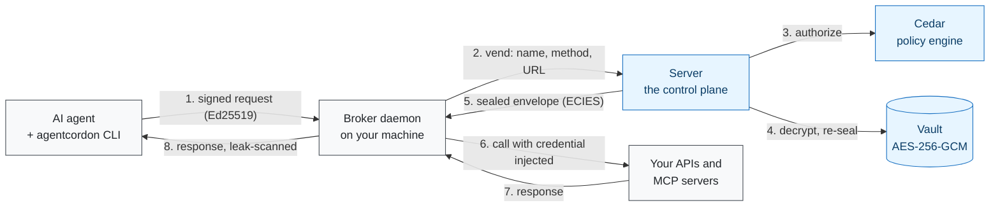

# AgentCordon documentation

### Credential brokering and policy enforcement for AI agents

  

---

AgentCordon sits between your AI agents and the secrets they need. Agents never hold
long-lived credentials: the CLI signs every request to its broker with an Ed25519 workspace
key, the broker presents an opaque OAuth 2.0 access token to the server, the server decides
with Cedar, and the broker injects the credential into the outgoing call so the agent never
sees a raw secret.

The [README](../README.md) is the short version and the quick start. This is the index to
everything else.

> **Port 3140 is the default, and every diagram, URL and example in this documentation
> assumes it.** Change it with `AGTCRDN_LISTEN_ADDR` (the address and port the server binary
> binds) or, under Compose, with `AGTCRDN_PORT` (the *host* side of the published mapping),
> and read the examples with your own port substituted.

---

## Getting started

| Page | Description |
|---|---|
| **[Installation](installation.md)** | Every way to install the server, the CLI and the broker — Compose, `docker run`, Tailscale, the server's own `install.sh`, GitHub releases, Windows, and a source build |
| **[Configuration](configuration.md)** | Every environment variable for all three binaries, with its default, its clamps and which process reads it |
| **[Deployment](deployment.md)** | The production shape: reverse proxy, base URL, volumes, the single-instance lock, secrets, backups |
| **[Workspace Enrollment](workspace-enrollment.md)** | How an agent establishes identity — Ed25519 keypairs, the device-code flow, the approval screens |
| **[Admin UI](admin-ui.md)** | A map of the browser console: what is on each screen, its primary action, what is behind the overflow, and which roles see it |
| **[Granting MCP Server Access](granting-mcp-server-access.md)** | Connecting workspaces to MCP servers, marketplace templates, OAuth provider clients |
| **[Upgrading](upgrading.md)** | Migrations, backups, rollback, and the 0.4.0 breaking changes |

## Architecture and security

| Page | Description |
|---|---|
| **[System Architecture](system-architecture.md)** | The five crates, the API routes, the middleware, and sequence diagrams for a credential vend and an OAuth2 MCP install |
| **[Authorization & Cedar Policy](authorization-and-cedar-policy.md)** | Entity types, actions, deny-by-default, a walkthrough of the default policy |
| **[Credential Encryption](credential-encryption.md)** | AES-256-GCM at rest, ECIES vending, credential transforms, vaults, SSRF protection |
| **[Master Key](master-key.md)** | HKDF-SHA256 key derivation, zeroization, nonce safety, key rotation |

## Reference

| Page | Description |
|---|---|
| **[CLI Reference](cli-reference.md)** | Every command and flag: `init`, `register`, `status`, `credentials`, `proxy`, `mcp-servers`, `mcp-tools`, `mcp-call` |
| **[Releasing](releasing.md)** | Cutting a release: one `cargo release` command, what the tag triggers, pre-releases, what to do when a job fails |
| **[Roadmap](roadmap.md)** | The ranked directions and why each belongs to this project: step-up approval with a passkey first, then impact preview, sub-agent attenuation, secretless cloud access, policy replay, an MCP firewall, data-flow policy, budgets, a red-team suite |
| **[Domain glossary](../CONTEXT.md)** and **[decision records](adr/README.md)** | Every domain term as the code uses it, with the file it lives in; and one ADR per architectural decision |

---

## Key capabilities

| Capability | What it means |
|---|---|
| **Credential vending** | Credentials are encrypted at rest with AES-256-GCM and released only as a single-use ECIES envelope sealed to one broker's key. Agents never see a raw secret. |
| **Cedar policy engine** | Deny by default, per workspace, per credential, per action, with a tester page that shows which rules decided. |
| **MCP servers** | Install one from the marketplace and bind it to any of your workspaces. The broker fronts it, and every tool call is policy-checked and leak-scanned. |
| **Ed25519 + P-256 identity** | Ed25519 request signing from the CLI, RFC 8628 device-code enrollment, opaque OAuth 2.0 bearer tokens — no passwords, no API keys, and no JWT for a client to verify. |
| **Full audit trail** | Every credential vend, policy decision and tool call is an append-only row with a correlation id. |
| **Five-crate Rust workspace** | Core library, control-plane server, broker daemon, thin CLI and a shared identity crate, over SQLite. |

---

## Architecture at a glance

The CLI talks to the **broker**, never to the server directly. The broker binds `127.0.0.1`
on a port it picks at startup and writes the URL to `~/.agentcordon/broker.port`; the CLI
reads that file to find it. [System Architecture](system-architecture.md#data-flow) draws
the same path in full, with every check in the order the code runs it.
