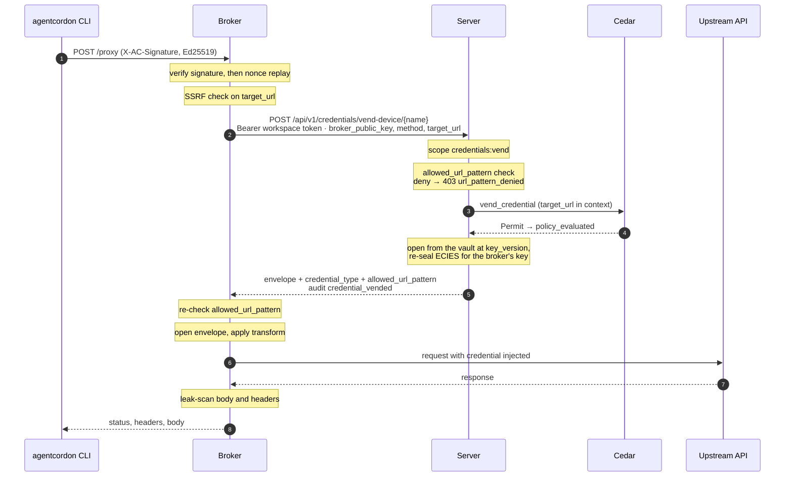
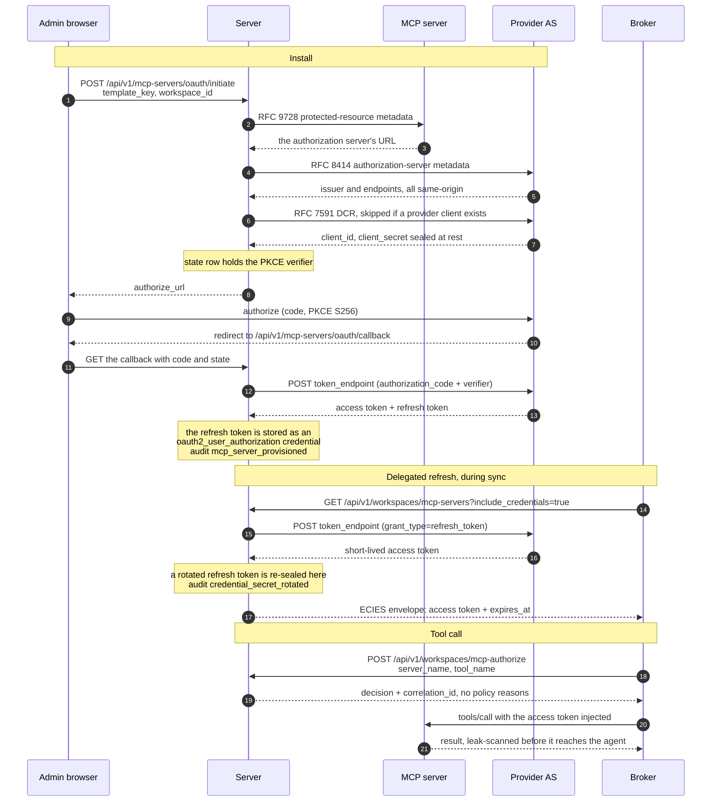

> [Home](index.md) > System Architecture

# System Architecture

AgentCordon is a **5-crate Rust workspace** that separates concerns into **core** (shared library), **server** (control plane), **broker** (per-user credential daemon), **cli** (thin workspace agent), and **identity** (the signing and key-file code the CLI and the broker must agree on byte for byte). The server stores credentials and enforces Cedar policy; the broker manages OAuth tokens and proxies credential-injected API calls; the CLI signs requests to the broker and never touches credentials directly.

---

**On this page:**
[Project Structure](#project-structure) · [API Routes](#api-routes) · [Middleware](#middleware-stack) · [Data Flow](#data-flow) · [MCP Architecture](#mcp-architecture) · [Database](#database) · [Deployment](#deployment) · [Observability](#observability)

---

## Project Structure

```
crates/
  core/         Domain types, Cedar policy engine, crypto (AES-256-GCM key ring,
                ECIES, HKDF), storage, wire types, transforms, SSRF and
                URL-pattern checks
  server/       Control plane: Axum HTTP server, admin API and console, OAuth
                authorization server, credential vault, audit pipeline
  broker/       Per-user daemon: OAuth token store, credential vending,
                upstream HTTP proxy, MCP sync and tool calls
  cli/          Thin CLI (`agentcordon`): workspace identity, signed requests
                to the broker
  identity/     Ed25519 key file, `sha256:` identity, request and register
                signing — shared by the CLI and the broker, with frozen test
                vectors
migrations/     Forward-only SQLite schema migrations, embedded in `core`
policies/       The Cedar schema and the default policy
data/           Built-in credential, MCP and policy templates, embedded in the
                server at compile time
docs/           This documentation
uat/            End-to-end acceptance suite (Playwright)
```

Three binaries come out of it: `agent-cordon-server` (the control plane),
`agentcordon-broker` (the daemon) and `agentcordon` (the CLI).

---

### `core` -- `agent-cordon-core`

The foundation crate, used by server and broker.

| Module | Purpose |
|--------|---------|
| `crypto/` | Versioned AES-256-GCM key ring (`key_ring`), ECIES (P-256), HKDF-SHA256, Argon2id |
| `policy/` | Cedar policy engine (`CedarPolicyEngine`), entity builders, schema |
| `domain/` | Data models: Agent, Audit, Credential, Device, Mcp, McpOAuth, OAuthProviderClient, Oidc, Policy, Session, User, Vault, Workspace |
| `storage/` | Trait-based DB layer over SQLite, the one backend |
| `auth/` | OIDC, password hashing |
| `oauth2/` | OAuth2 client credentials token manager, token utilities, scope types |
| `proxy/` | URL safety (resolving SSRF check over the full reserved set), structural URL-pattern matching, leak scanning. The broker runs the scanner over proxied response bodies **and** over MCP tool results and `tools/list` discovery probes, replacing any injected value with `[REDACTED]`. |
| `wire/` | The server<->broker wire types, defined once and shared by both (ADR-0005) |
| `transform/` | Built-in transforms and the sandboxed Rhai engine for custom ones |

> [!NOTE]
> **Storage Architecture:** A composite `Store` trait inherits 14 sub-traits (UserStore, SessionStore, CredentialStore, DeviceCodeStore, SecretHistoryStore, PolicyStore, AuditStore, VaultStore, McpStore, McpOAuthStore, OAuthProviderClientStore, OAuthStore, OidcStore, WorkspaceStore). The SQLite backend implements them; it is the only backend.

---

### `server` -- `agent-cordon-server`

The control plane. Runs on port **3140** (configurable via `AGTCRDN_LISTEN_ADDR`).

**Startup Sequence** (`crates/server/src/main.rs`):

```
 1. Load config from environment variables
 2. Initialize tracing (JSON or pretty format)
 3. Derive cryptographic keys from master secret (HKDF-SHA256)
 4. Initialize storage (SQLite) + run migrations
 5. Seed default Cedar policy (if none exist)
 6. Run data migrations (e.g. MCP policy name-to-ID migration)
 7. Wrap policy engine in AuditingPolicyEngine (auto-emits audit events)
 8. Bootstrap root user (auto-generate password if needed)
 9. Load credential, MCP, and policy templates
10. Build HTTP router (axum)
11. Start TCP listener
12. Run background cleanup task (expired sessions, OIDC states, MCP OAuth states, rate limiter entries; configurable interval, default 300s)
```

**AppState** (`crates/server/src/state.rs`):

| Field | Type | Description |
|-------|------|-------------|
| `store` | `Arc<dyn Store>` | Database (SQLite) |
| `policy_engine` | `Arc<AuditingPolicyEngine>` | Cedar authorization with automatic audit event emission |
| `encryptor` | `Arc<AesGcmEncryptor>` | Credential encryption/decryption |
| `config` | `AppConfig` | Server configuration |
| `login_rate_limiter` | `Arc<LoginRateLimiter>` | Per-username login attempt rate limiting |
| `device_approve_limiter` | `Arc<DeviceApproveRateLimiter>` | Per-(IP,user) rate limiter for device flow approve/deny |
| `metrics_handle` | `PrometheusHandle` | Prometheus metrics renderer |
| `session_hash_key` | `[u8; 32]` | HMAC session token hashing |
| `oauth2_token_manager` | `OAuth2TokenManager` | Token caching for OAuth2 credentials |
| `http_client` | `reqwest::Client` | Shared HTTP client for proxy routes |
| `event_bus` | `EventBus` | Tokio broadcast for device SSE |
| `ui_event_bus` | `UiEventBus` | Browser SSE events |
| `sse_tracker` | `SseConnectionTracker` | Per-user SSE connection limiter |
| `credential_templates` | `Vec<CredentialTemplate>` | Pre-loaded credential templates |
| `mcp_templates` | `Vec<McpServerTemplate>` | Pre-loaded MCP server templates |
| `policy_templates` | `Vec<PolicyTemplate>` | Pre-loaded policy templates |

---

### `broker` -- `agentcordon-broker`

The per-user persistent daemon. Binds `127.0.0.1` on an auto-selected port by default (`AGTCRDN_BROKER_PORT` defaults to `0`) and writes the URL it chose to `~/.agentcordon/broker.port`, which is how the CLI discovers it. There is no fixed default port; `AGTCRDN_BROKER_URL` overrides discovery. Manages OAuth2 tokens, proxies credential-injected API calls, and syncs MCP server configs from the server.

**Key responsibilities:**
- Holds OAuth2 access/refresh tokens in memory (encrypted at rest in `tokens.enc`)
- Handles RFC 8628 device authorization grant flow for workspace registration
- Proxies HTTP requests with credential injection: vends from the server naming the request's method and target URL, ECIES-decrypts, re-checks the target against the credential's `allowed_url_pattern` (fails closed for non-generic credentials without one), transforms, injects
- Sends upstream through a dedicated client: no redirects (a 3xx is returned to the CLI), request timeout, 10 MiB response cap, hop-by-hop headers stripped both ways, bodies forwarded verbatim
- Redacts any injected secret found in the upstream response body or headers (raw, base64, URL-safe base64, percent-encoded)
- Applies the resolving SSRF check to proxy targets, MCP tool calls, and MCP tool-list probes
- Syncs MCP server configs from the server on a configurable interval
- Background token refresh before expiry
- Recovery from encrypted token store with plaintext fallback (`workspaces.json`)

**BrokerState** (`crates/broker/src/state.rs`):

| Field | Type | Description |
|-------|------|-------------|
| `workspaces` | `RwLock<HashMap<String, WorkspaceState>>` | OAuth tokens keyed by Ed25519 public key hash |
| `pending` | `RwLock<HashMap<String, PendingDeviceRegistration>>` | In-flight device authorization registrations |
| `registration_errors` | `RwLock<HashMap<String, String>>` | Recent registration failures for CLI feedback |
| `mcp_configs` | `RwLock<HashMap<String, Vec<CachedMcpServer>>>` | Cached MCP server configs per workspace |
| `server_url` | `String` | AgentCordon server URL |
| `http_client` | `reqwest::Client` | Client for the AgentCordon server |
| `upstream_client` | `reqwest::Client` | Client for proxied and MCP upstream calls (no redirects, capped) |
| `encryption_key` | `p256::SecretKey` | P-256 keypair for ECIES operations |
| `config` | `BrokerConfig` | Broker configuration |

**Broker Routes** (`crates/broker/src/routes/mod.rs`):

| Method | Path | Auth | Description |
|--------|------|------|-------------|
| GET | `/health` | No | Health check |
| POST | `/register` | No | Start device authorization registration |
| GET | `/status` | Ed25519 | Check workspace and token status |
| POST | `/deregister` | Ed25519 | Remove workspace registration |
| GET | `/credentials` | Ed25519 | List available credentials |
| POST | `/credentials/create` | Ed25519 | Store a new credential |
| POST | `/proxy` | Ed25519 | Proxy HTTP request with credential injection |
| POST | `/mcp/list-servers` | Ed25519 | List MCP servers |
| POST | `/mcp/list-tools` | Ed25519 | List MCP tools |
| POST | `/mcp/call` | Ed25519 | Call an MCP tool |

---

### `cli` -- `agentcordon-cli` (binary: `agentcordon`)

The thin CLI binary that agents use. It manages Ed25519 keypairs, signs requests to the broker, and never touches credentials directly.

| Command | Description |
|---------|-------------|
| `init` | Generate the Ed25519 keypair, write `.agentcordon/`, and write the agent instruction files (`--agent`) |
| `register` | Start device authorization registration via the broker; auto-starts one with `--server-url` |
| `status` | Check workspace and broker status |
| `credentials` | List available credentials |
| `credentials create` | Create a new credential via the broker |
| `proxy` | Proxy HTTP request through the broker with credential injection |
| `mcp-servers` | List available MCP servers |
| `mcp-tools` | List available MCP tools |
| `mcp-call` | Call an MCP tool |

> See the [CLI Reference](cli-reference.md) for complete command documentation.

---

## API Routes

### Control Plane (Workspace-Facing)

Authenticated with a workspace OAuth2 access token (`Authorization: Bearer {token}`). The token is bound to its workspace by id; the extractor resolves token, client, and workspace in one store call and admits only `active` workspaces.

| Method | Path | Description |
|--------|------|-------------|
| GET | `/api/v1/workspaces/mcp-servers` | Sync MCP server configs (with optional credential envelopes) |
| GET | `/api/v1/workspaces/mcp-tools` | Sync MCP tools |
| POST | `/api/v1/workspaces/mcp-authorize` | Authorize MCP access |
| POST | `/api/v1/credentials/vend-device/{name}` | Vend a credential for a named target (`method`, `target_url` in the body; refused outside the credential's `allowed_url_pattern`) |

### OAuth 2.0 Authorization Server

| Method | Path | Description |
|--------|------|-------------|
| POST | `/api/v1/oauth/clients` | Dynamic client registration |
| GET | `/api/v1/oauth/clients` | List registered clients |
| DELETE | `/api/v1/oauth/clients/{id}` | Revoke a client |
| GET | `/api/v1/oauth/authorize` | Authorization code flow (GET) |
| POST | `/api/v1/oauth/authorize` | Authorization code flow (POST/consent) |
| POST | `/api/v1/oauth/device/code` | RFC 8628 device code request |
| POST | `/api/v1/oauth/device/approve` | Approve device code (rate-limited) |
| POST | `/api/v1/oauth/device/deny` | Deny device code (rate-limited) |
| POST | `/api/v1/oauth/token` | Token exchange (auth code, device code, refresh) |
| POST | `/api/v1/oauth/revoke` | Token revocation |

### Admin API (User-Facing)

Authenticated with session cookie (from user login).

| Category | Endpoints |
|----------|-----------|
| Auth | Login at `/api/v1/auth/login`, logout, me; OIDC at `/api/v1/auth/oidc/*` |
| Credentials | CRUD at `/api/v1/credentials`, vend at `/{id}/vend`, reveal, secret-history, agent-store |
| Workspaces | List/manage at `/api/v1/workspaces`, tags, consents, `POST /{id}/revoke` (final; revokes clients and tokens in one transaction) |
| Policies | CRUD at `/api/v1/policies`, validate, test, schema, RSOP |
| MCP Servers | CRUD at `/api/v1/mcp-servers`, import, provision, OAuth initiate/callback, generate-policies, permissions, workspace bindings (share/unshare at `/api/v1/mcp-servers/{id}/workspaces`) |
| Users | CRUD at `/api/v1/users`, change-password |
| Audit | List at `/api/v1/audit`, export (CSV, syslog, JSONL), detail |
| Vaults | CRUD at `/api/v1/vaults` (create, list, rename by id, delete an empty one), vault credentials, read-only shares at `/api/v1/vaults/{id}/shares` |
| OIDC Providers | CRUD at `/api/v1/oidc-providers` |
| OAuth Provider Clients | CRUD at `/api/v1/oauth-provider-clients` |
| Templates | Credential templates, MCP templates, policy templates |
| Admin | Master-key rotation at `/api/v1/admin/rotate-key` (re-seals credentials and history under the current key version) |
| Stats | Dashboard stats at `/api/v1/stats` |
| Settings | Server settings at `/api/v1/settings` |

### Admin UI Page Routes

Askama-rendered HTML behind a session cookie (`page_auth` redirects to `/login`
rather than answering 401). Each page is a shell: its script fetches every list
and record from the admin API above, so a page can never show more than Cedar
already allows. [Admin UI](admin-ui.md) describes what is on each screen.

| Path | Page |
|------|------|
| `/dashboard` | Counts, first-run checklist, recent activity (`/` redirects here) |
| `/credentials`, `/credentials/new`, `/credentials/{id}` | Credential list, form, and full-page detail |
| `/workspaces`, `/workspaces/{id}` | Workspace list and full-page detail |
| `/security`, `/security/new`, `/security/{id}`, `/security/tester` | Policies (the nav label) and the policy tester |
| `/mcp-servers`, `/mcp-servers/marketplace`, `/mcp-servers/{id}` | MCP server list, the marketplace, and per-server detail |
| `/audit`, `/audit/{id}` | Audit log |
| `/settings`, `/settings/users/new` | Settings, with its section rail; user management is the `#users-section` section of `/settings`, and `/settings/users/new` the create form |
| `/register`, `/activate`, `/activate/{success,denied,expired}` | Enrollment and device-flow activation |
| `/login` | The only unauthenticated page route |

Redirects (`routes/admin_ui/pages/mod.rs`): `/policies*` → `/security*`, `/users`
and `/settings/users` → `/settings#users-section`, `/users/new` →
`/settings/users/new`, `/marketplace` and
`/mcp-marketplace` → `/mcp-servers/marketplace`, `/credentials/{id}/view` and
`/workspaces/{id}/view` → the record's canonical page, `/agents` and `/devices` →
`/workspaces`, `/mcp` → `/mcp-servers`.

### Shared Routes

| Method | Path | Description |
|--------|------|-------------|
| GET | `/health` | Health check |
| GET | `/metrics` | Prometheus metrics |
| GET | `/install.sh` | POSIX `sh` installer for the CLI and broker; downloads the matching GitHub release assets and verifies them against the release `SHA256SUMS`. Templated with `AGTCRDN_BASE_URL` (falling back to the request `Host`). |
| GET | `/swagger` | Embedded Swagger UI over `/api/v1/openapi.yaml` |
| GET | `/api/v1/openapi.yaml` | OpenAPI 3.1 spec (unauthenticated) |

---

## Middleware Stack

Applied outside-in on every request:

| Order | Middleware | Description |
|:-----:|-----------|-------------|
| 1 | **Request ID** | Generates UUID, injects into request extensions |
| 2 | **HTTP Metrics** | Prometheus counters and latency histograms |
| 3 | **Request Logging** | Structured JSON logs (method, path, status, latency) |
| 4 | **CSRF Protection** | Token validation for POST/PUT/DELETE |

---

## Data Flow

### A credential vend

What `agentcordon proxy github-token GET https://api.github.com/user` does, end to end.



The order of the checks is the point.

The broker verifies the Ed25519 signature **before** it consults the nonce seen-set, so only
a verified, registered key can consume an entry in it. It runs the resolving SSRF check on
the target **before** asking for a credential, so a request to a private address never
causes a vend at all.

The hop from the broker to the server carries an opaque OAuth 2.0 access token, not a
workspace signature: the signature covers the CLI-to-broker hop only. The server checks the
credential's `allowed_url_pattern` **before** Cedar, because a target outside the fence is a
credential-configuration problem rather than a policy one — it answers 403
`url_pattern_denied` and writes a `credential_vend_denied` row, so a reader is not sent to
the policy pages for something no policy will fix. Only then does Cedar decide, with
`target_url` in the evaluation context so a policy can narrow the fence further.

The server opens the credential with the key its `key_version` names and re-seals it under
ECIES for the broker's own P-256 key, with the workspace, credential, vend id and timestamp
as associated data; the broker refuses an envelope whose associated data is not the one it
asked for. The broker then checks `allowed_url_pattern` a second time, against the response
the server just sent, before injecting anything (ADR-0007). A credential with no pattern is
accepted only when its type is `generic`; every other type fails closed.

Everything coming back is scanned. The leak scanner runs in the **broker**, over the
response body and every response header, replacing each injected value with `[REDACTED]` —
raw, base64, URL-safe base64 and percent-encoded alike.

The broker answers the CLI with `200` whatever the upstream said; the upstream status is a
field in the body, and the CLI exits non-zero when it is 400 or above.

### An OAuth2 MCP install, and the delegated refresh behind every tool call



The install runs entirely between the admin's browser and the server. A provider client
already registered for that authorization server's origin is reused, so DCR happens once
per provider rather than once per install (ADR-0004). The PKCE verifier lives in the
server-side state row, never in a cookie; the state is single-use and bound to the user who
started the flow. The redirect URI is `{AGTCRDN_BASE_URL}/api/v1/mcp-servers/oauth/callback`
and the install fails outright when `AGTCRDN_BASE_URL` is unset — it deliberately does not
fall back to the listen address, because a registered redirect URI is not something to guess.

What lands in the vault is the **refresh** token, stored as an `oauth2_user_authorization`
credential. It never leaves the server (ADR-0006). Every time the broker syncs, the server
runs the `refresh_token` grant itself and seals only the resulting short-lived access token
and its expiry into the envelope. If the provider rotates the refresh token, the new one is
re-sealed and the old one archived in the same transaction that hands out the access token;
if that write fails, the token cache is evicted and no access token is handed out at all.

The broker never calls a provider token endpoint. A tool call asks the server for a decision
first — `mcp-authorize` returns a decision and a correlation id and deliberately no policy
reasons, so a workspace cannot enumerate the policy graph — and the reasons are in the
`policy_evaluated` audit row that correlation id names.

---

## MCP Architecture

The broker syncs MCP server configurations from the server and caches them with pre-vended credentials. The CLI's `mcp-call` command routes MCP tool calls through the broker, which resolves credentials and proxies to upstream MCP servers.

`agentcordon init` does **not** write `.mcp.json`. There is no `agentcordon mcp-serve`
subcommand for such an entry to point at; agents reach MCP through `agentcordon
mcp-servers` / `mcp-tools` / `mcp-call`, which is what the generated `AGENTS.md` tells them.

### Transport Types

| Transport | How It Works |
|-----------|-------------|
| **HTTP/HTTPS** | Broker sends requests to upstream MCP server URL with credential-injected headers |

### Credential Injection

MCP server credentials are synced from the server with ECIES-encrypted envelopes. The broker decrypts and caches them. During MCP tool calls, credentials are injected into upstream requests based on the server's `auth_method` configuration.

Credential values are **never logged** (the `CachedCredential` type has a manual `Debug` impl
that redacts the `value` field), and the broker leak-scans everything that comes back.
`tools/call` results and the broker's `tools/list` discovery probes both pass through the
same `LeakScanner` the `/proxy` path runs on an upstream response body: every injected
header value, query value, and the raw credential material becomes `[REDACTED]` before any
of it reaches the agent, and the substitution is logged at `warn` with the server name.

A disabled MCP server (`enabled = false`) is dropped from the sync payload and every
`mcp_tool_call` / `mcp_list_tools` against it is refused by the default policy's forbid on
`!resource.enabled`, so disabling takes effect ahead of the next broker sync tick.

### Config Sync

MCP server configs are synced on a configurable interval (`AGTCRDN_MCP_SYNC_INTERVAL`, default 60s):

1. **Server** (`GET /api/v1/workspaces/mcp-servers?include_credentials=true`) -- authoritative metadata with ECIES-encrypted credential envelopes
2. **Broker cache** (`BrokerState::mcp_configs`) -- decrypted credentials cached in memory per workspace

Secrets stay on the server. For an OAuth-backed credential (`oauth2_user_authorization`, `oauth2_client_credentials`) the server runs the upstream `refresh_token` or `client_credentials` exchange itself (`crates/server/src/services/upstream_tokens.rs`, over the shared `OAuth2TokenManager` cache) and seals only the resulting short-lived access token and its `expires_at` into the envelope. The refresh token and the provider client secret never leave the server; a refresh token the provider rotates is persisted there with a secret-history row and a `CredentialSecretRotated` audit event. The same applies to `POST /api/v1/credentials/vend-device/{name}` for `oauth2_client_credentials` credentials.

The broker never calls a token endpoint. It treats the envelope value as a bearer and syncs again when a cached token is within 60 s of `expires_at` or when the upstream MCP server answers 401 (one retry). A server that could not produce a token is reported in the entry's `credential_error` field with no envelope; the rest of the sync is unaffected.

---

## Database

SQLite is the only storage backend. `AGTCRDN_DB_PATH` (default
`./data/agent-cordon.db`) names the database file; a path containing
`:memory:` runs in memory, which the tests use and a server should not.

A single-node deployment is the supported shape: the server takes a
single-instance lock next to the database file (see `AGTCRDN_REPLICA_MODE`),
because policy caches, rate limiters and SSE state are per process.

The PostgreSQL backend was removed in 0.4.0. `AGTCRDN_DB_TYPE` and
`AGTCRDN_DB_URL` are no longer read; a server started with either set refuses
to boot with a message naming the variable, so an old `.env` fails loudly
instead of silently opening the wrong database.

### Key Tables

`users` . `workspaces` . `sessions` . `credentials` . `credential_secret_history` . `policies` . `audit_events` . `mcp_servers` . `mcp_server_workspaces` . `mcp_oauth_states` . `oauth_clients` . `oauth_auth_codes` . `oauth_access_tokens` . `oauth_refresh_tokens` . `oauth_consents` . `oauth_provider_clients` . `oidc_providers` . `oidc_auth_states` . `user_oidc_identities` . `vaults` . `vault_shares` . `device_codes` . `schema_migrations`

Migration 020 drops `workspace_used_jtis`, `workspace_registrations`, `provisioning_tokens` and `crypto_state`; nothing read them.

Migrations are the forward-only SQL files in `/migrations/`, embedded in the `agent-cordon-core` crate and applied at startup.

---

## Deployment

The shipped `docker-compose.yml` runs one server container publishing
`${AGTCRDN_PORT:-3140}:3140` with a named `agentcordon-data` volume on `/data`.
`AGTCRDN_PORT` there is the **host** side of the published mapping and nothing else: the
binary never reads it, and binds `AGTCRDN_LISTEN_ADDR` (default `0.0.0.0:3140`), which is
the container-internal `3140`.

[Installation](installation.md) covers every way to start the server;
[Deployment](deployment.md) covers the production shape — reverse proxy, base URL, volumes,
the single-instance lock, backups and upgrades. Every environment variable, with its
default and its clamps, is in [Configuration](configuration.md).

---

## Observability

| Channel | Details |
|---------|---------|
| **Structured logging** | JSON format with tracing spans, correlation IDs, and log levels |
| **Prometheus metrics** | Available at `GET /metrics` -- request counts, latency histograms, policy evaluation counters |
| **Audit events** | Stored in database, queryable via `GET /api/v1/audit`, exportable as CSV/syslog/JSONL |
| **SSE events** | Real-time push to connected clients via `EventBus` (device) and `UiEventBus` (browser) |
| **Correlation IDs** | Every request gets a UUID injected by the request ID middleware |

---

> **See also:** [Master Key](master-key.md) . [Credential Encryption](credential-encryption.md) . [Authorization & Cedar Policy](authorization-and-cedar-policy.md)
